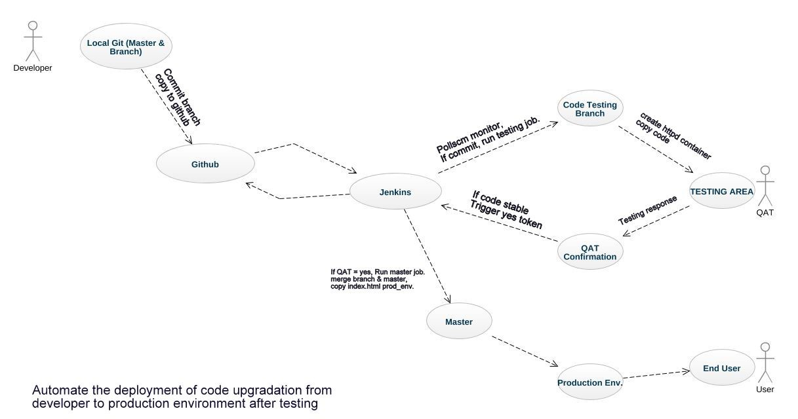

# Dev-ops Assembly Lines Assignment

Automate the deployment of code upgradation from developer to production environment after testing.

## Objectives:-

1)	When developer commit a code while upgrading in the branch of git tool. It will send to QA Team. A testing environment is created and the upgraded code is copied there to test.
2)	If QA team found the code stable. They trigger that the code is working fine.
3)	If code is working fine then, merge the branch to master and copy it to production Environment.

### Solution 1 –
We create a job (branch) in Jenkins which have three functions: 
-When developer commit a code it will push to the github with post-commit shell script. And Jenkins Monitoring the changes in the github repository using Poll SCM trigger.
-If found any update it will create testing environment within a second for the testing team.
-Copy the code from github to the testing environment.
